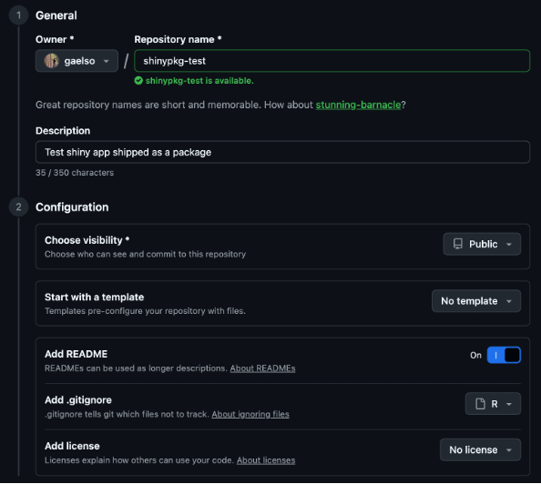

{fig-align="center" width="60%"}

# Introduction {.unnumbered}

## Why developing shiny applications as R packages {.unnumbered}

This tutorial lays out the main steps and provide R code to create a barebone shiny application shipped as a package. The main advantage of this approach is to make complex applications easier to read and to maintain, mainly thanks to:

1.  Forcing code documentation,
2.  Code splitting between analytical functions and shiny modules,
3.  Setting dependency package versions for ensuring the app will work even if dependency updates would break the package code.
4.  Combine R, Rstudio and Github for backup and easy shipping of the application's package.
5.  Package automated checks for CRAN submission that are helpful to debug and improve the code.
6.  Package users can access the shiny application with 2 line codes (one to install the package, one to run the app).

The two main changes with non-package R code are:

-   Each function call from another package should be explicit, using `pkg::fct()` instead of `library(pkg); fct()`.

-   Functions created in the package should be documented with:

    -   A short description of what the function does,

    -   An explanation of each input variable,

    -   An description of the function's output

    -   An example of the function in action

While potentially more time consuming at first, writing a complex shiny app code as a package makes it much easier to maintain and for other to understand and contribute.

## Where to find more information {.unnumbered}

This document is based on the following references:

-   <https://r-pkgs.org/>
-   <https://happygitwithr.com/>
-   <https://rstudio.github.io/bslib/>
-   <https://appsilon.github.io/shiny.i18n/articles/basics.html>
-   <https://rstudio.github.io/crosstalk/using.html>
-   <https://engineering-shiny.org/index.html>

## Core steps {.unnumbered}

The core steps of the package development are:

1.  Create a Github repository to host the application's package,
2.  Create a linked Rstudio project to the Github repository,
3.  Create the package core files in the Rstudio project,
4.  Copy/paste the function and module template files to the R project,
5.  Install the barebone package to make assets available,
6.  Develop the application functions (modules and analytical), going back and forth between these 4 actions:
    1.  Edit the template files to customize the application,
    2.  Create / update new files / functions as necessary,
    3.  Load functions to the local environment, update documentation, run checks (resp. `load_all()`, `document()` and `check()` from the `devtools` package),
    4.  Commit and push changes to the Github repository,
    5.  Install the package,
    6.  Develop tutorials with vignettes.

# Setup

## Github repository and R project 

### Abbreviations

Through this tutorial we will use the following names that should be replace with your own chosen names specific to your package. They are all caps to be easy to spot but should be small caps in your project.

-   **PKGNAME**: name of your package.

-   **GHACCOUNT**: Github account where the package repository is hosted.

-   **`shiny_run_APPNAME()`**: the function that will launch the core Shiny app of the package. APPNAME and PKGNAME could be the same.

### Step-by-step

-   Decide your package name.
-   Create a Github repository with the package name as repository name.
    -   Ideally include a Readme during repo creation and a gitignore for R. A license can be done later.

        
-   Setup connection between Github and Rstudio (see happy git with R in the reference list for detailed instructions).
-   In Rstudio, create a new project, choose **version control** as type of project and link your Github repository (with `https` or `ssh` depending on how you connected Rstudio and Github).
-   Commit and push the project to have Rstudio Rproj files sync with Github.

## Core package files

Once you have a github repo and linked R project, the rest of the setup is done with R using functions from the `devtools` and `usethis` packages mostly.

You can either create a temporary R script or markdown/quarto document in your project to have the key functions ready to run or copy/paste from here to the console. The package creation functions shown in this section are needed only one time.

Here is a core set of instructions to setup your package:

```{r}
## Load install libraries (install first if needed)
library(devtools) 
library(usethis) 
library(roxygen2)

## Create package in a version controled Rproject
## Requires overriding the .Rproj file 
usethis::create_package(".")

## Add dependencies, i.e. all the packages that are needed to run the
## package's functions. Here is a non exhaustive list needed for the
## barebone app.
## + Shiny
usethis::use_package("bsicons")
usethis::use_package("bslib") 
usethis::use_package("htmltools") 
usethis::use_package("shiny") 
usethis::use_package("shiny.i18n")
usethis::use_package("shinyjs") 
usethis::use_package("shinyWidgets")

## + Tidyverse (Better to call packages individually)
usethis::use_package("dplyr")
usethis::use_package("rlang")

## + misc 
usethis::use_package("datasets")
usethis::use_package("crosstalk")
usethis::use_dev_package("d3scatter", remote = "jcheng5/d3scatter")

## Add license
usethis::use_mit_license()

## Add github actions
## + package checks
# usethis::use_github_action_check_standard()
usethis::use_github_action("check-standard")

## + turn package doc into GH pages
# usethis::use_pkgdown()
usethis::use_github_action("pkgdown")

```

# Barebone App

The barebone app consists of a shiny application with the following characteristics:

-   a Boostrap 5 general design template,

-   a navigation bar,

-   three pages (Home, Tool, About)

-   The home page has a modern design with hero section and cards to place context information

-   The tool page is structured with a sidebar and tabsets to spread the figures / tables into various sub-pages.

-   The tool allow for direct translation with the `i18n` package,

-   pkgdown and Github Actions make the package documentation and tutorials turned automatically into Github webpages.

## R scripts

### File naming

All the functions are placed under the project's `R/` directory. File names should be the same as the function names, such as `function_name.R` and `function_name()`:

-   functions that process and analyse data, recommended file names: `fct_*.R` (prefixing is not mandatory but recommended to make then clearly visible from shiny related functions in `R/` and from other packages functions in the code),

-   main shiny app function, recommended naming: `shiny_run_PKGNAME.R`,

-   shiny module functions. It is recommended to prefix file names with `'mod_*_ui.R'` and `'mod_*_server.R'`.

### Get the template files

The R files can be downloaded from the template Github repository and placed in a new package `R/` sub-folder either manually or with the following code:

```{r}
## Requires packages 'gh' (comes with usethis) and 'purrr'
dl_dir <- "R"
gh_paths <- gh::gh(
  "/repos/{owner}/{repo}/contents/{path}",
  owner = "openforis", repo = "shinypkg-template", path = dl_dir
  )

if (length(list.files(dl_path)) == 0) {
  dir.create(dl_dir)
  purrr::walk(seq_along(gh_paths), function(x){
    download.file(
      url = gh_paths[[x]]$download_url,
      destfile = gh_paths[[x]]$path
    )
  })
}
```

**NOTE 1**: in the main file the application name, function name, title and other elements need to be tailored to your application. In particular:

-   In `R/shiny_run_APPNAME.R`:

    -   Script name itself

    -   `shiny_run_APPNAME <- function(...)`

    -   `translation_json_path = system.file("assets/translations.json", package = "PKGNAME")`

    -   Objects related to UI elements:

        -   app_title

        -   app_window_title

        -   footer

-   In `R/zzz.R`:

    -   `system.file("assets/translations.json", package = "PKGNAME")`

**NOTE 2:** At this stage, running the app function will not work as the app requires assets that need to be downloaded and the app installed to make the assets available.

## Assets 

The shiny app works with a number of assets, i.e. images, CSS style, javascript handlers, translation files etc. The assets for the barebone app are:

-   javascript code to handle changing tabset within a navbar page

-   logo and hero image

-   CSS style tweaks

-   translation file

The assets can be downloaded from the Github repository manually or with this code from within your package directory in a R project (important for enabling relative pathing):

```{r}
dl_dir <- "inst/assets"
gh_paths <- gh::gh(
  "/repos/{owner}/{repo}/contents/{path}",
  owner = "openforis", repo = "shinypkg-template", path = dl_dir
  )

if (length(list.files(dl_dir)) == 0) {
  dir.create("inst")
  dir.create(dl_dir)
  purrr::walk(seq_along(gh_paths), function(x){
    download.file(
      url = gh_paths[[x]]$download_url,
      destfile = gh_paths[[x]]$path
    )
  })
}

```

**IMPORTANT!**

In a standard shiny app, these files are placed in a `www/` folder under the app directory. But when the app is shipped as a package the path to the files have to be directed to the package files specific to each machine.

The solution is to place the files under `inst/assets` in the package directory (they will go to `assets` in the package directory), and find their path with:

```{r}
system.file("assets/FILENAME", package = "PKGNAME")
```

To avoid having to point to the package files for each asset, a script `R/zzz.R` was added with the following code, in order to shorten the paths to `assets/FILENAME`:

```{r}
#| file: "R/zzz.R"
#| lst-cap: "Script from R/zzz.R"
```

**NOTE 1**: This doesn't work only for one case: the translation file called in the main app script. The following code snippet requires the `system.file()` function explicitly in the main app script `R/shiny_run_APPNAME.R`:

```{r}
#| lst-cap: "Code snippet pointing to the translation file in: R/shiny_run_APPNAME.R"
i18n <- shiny.i18n::Translator$new(
    translation_json_path = system.file("assets/translations.json", package = "PKGNAME")
  )
```

**NOTE 2**: Once the assets are downloaded and placed in the correct folder, the package needs to be installed once to make the assets available. THis can be done with:

```{r}
devtools::install()
```

**Any change, addition or deletion of assets has to be followed by the package installation to be available form the app.**

## Data templates

If any dataset is required for the application, they should be placed in `inst/extdata`. They can be made available to the application with `system.files()` like the assets.

## Shiny modules

In the minimal working example, the app contains three modules, one for each page: home, tool and about. A group of reactive values embedded in `rv` can pass on reactive objects between the modules.

This allows to split the code into smaller scripts, making it easier to collaborate and find bugs.

## Deploying the app

If you want to host the app online with a service like shinyapps.io, you need to add a file in the root folder (NOT in the R folder, named `app.R`, with the following code:

```{r}
# Launch the ShinyApp (Do not remove this comment)
# To deploy, run: rsconnect::deployApp()
# Or use the blue button on top of this file

pkgload::load_all(export_all = FALSE, helpers = FALSE, attach_testthat = FALSE)
PKGNAME::shiny_run_APPNAME()
```

Remember to replace PKGNAME and APPNAME with the actual package and shiny app function names.

This will enable the **Publish** menu in the top right the script window in Rstudio. You can then click **Publish \> Publish application...** or run this command in the console:

```{r}
rsconnect::deployApp()
```

# Developing further

## Run often

Now the real work can start, these three functions can be run often after building/updating the package's functions for analytics or the shiny app UI and server.

```{r}
## Run often, as soon as you have a new function created or updated
devtools::load_all() 
PKGNAME::shiny_run_APPNAME()

## Update function documentation
## Every time a package is added or a function documentation created/improved
devtools::document()

## Runs checks to find errors in the code that prevent functions
## to work or notes that would make the package refused by CRAN.
## Useful for debugging 
devtools::check()
```

Once your package is ready for production, you can:

-   Install the package from local files

    ```{r}
    devtools::install()
    ```

-   Install from Github

    ```{r}
    remotes::install_github("GHACCOUNT/PKGNAME")
    ```

Installation is also required when assets / data are added or modified.

## The app in action

Following this tutorial, the barebone application was produced in the package shinypkgTest, available here: <https://github.com/gaelso/shinypkgTest>

The app can be run locally with the following code:

```{r}
if (!require(remotes)) install.packages("remotes")
if (!require(mocaredd)) remotes::install_github("gaelso/shinypkgTest")

mocaredd::shiny_run_APPNAME()
```

Or online at: <https://gaelsola.shinyapps.io/shinypkgtest/>

Happy coding!
